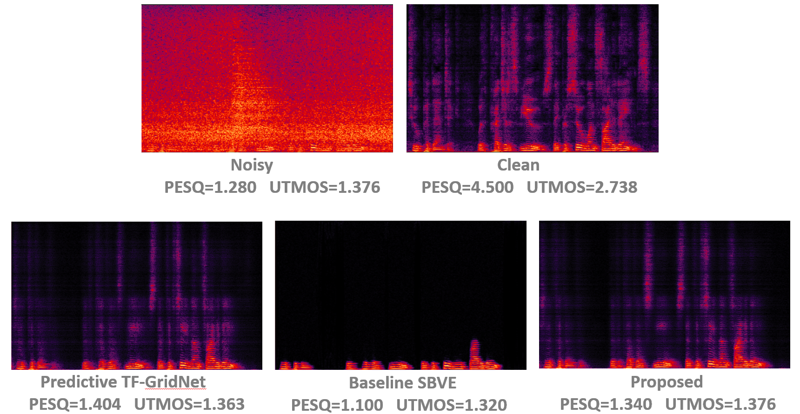
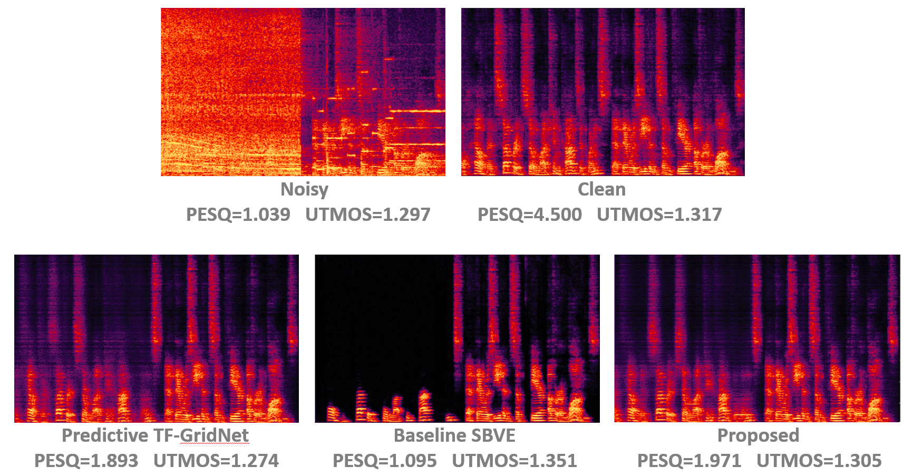

# Rethinking Flow and Diffusion Bridge Models for Speech Enhancement

This anonymous repository contains code and audio samples for the paper "**Rethinking Flow and Diffusion Bridge Models for Speech Enhancement**" submited to AAAI 2026. The code builds upon https://github.com/sp-uhh/sgmse.

## Usage
- For training:
  ```bash
  python train.py -D <available_gpus>  # e.g. -D 0 1 2 3
  ```
  See `config.yaml` for the training configuration.

- For fine-tuning:
  ```bash
  python train_crp.py -D <available gpus>  # e.g. -D 0 1 2 3
  ```
  See `config_crp.yaml` for the fine-tuning configuration.

- For testing:
  ```bash
  python enhancement_parallel.py -D <available_gpus> -B <batch_size_per_gpu>  # e.g. -D 0,1,2,3 -B 2
  ```
  See `config_infer.yaml` for the testing configuration.


## Audio Samples

- See `./audio_samples` for wav files.
- Example spectrograms
  
  
