# Rethinking Flow and Diffusion Bridge Models for Speech Enhancement

Arxiv: http://arxiv.org/abs/2602.18355

This repository contains the appendix, code, and audio samples for the **AAAI 2026 oral** paper: **Rethinking Flow and Diffusion Bridge Models for Speech Enhancement**.

- Updated on **February 22, 2026**.
- The arxiv version contains the appendix.
- Appendix: derivations, additional discussion, and experiment setup details.
- This project references: https://github.com/sp-uhh/sgmse

## Methodology
See the paper for the derivations and details.

### 1. Unified Theoretical Framework: 
- Encompassing existing flow matching and diffusion bridge models for speech enhancement.

<p align="center">
  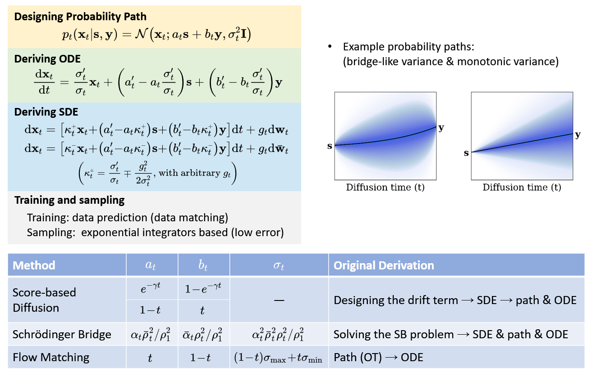
</p>

- See `fdbm/bridge.py` for flow matching and diffusion bridge models written with this logic.

### 2. Predictive Equivalence Insight:
- Revealing the inherent equivalence between flow matching/diffusion bridge models and predictive models.

<p align="center">
  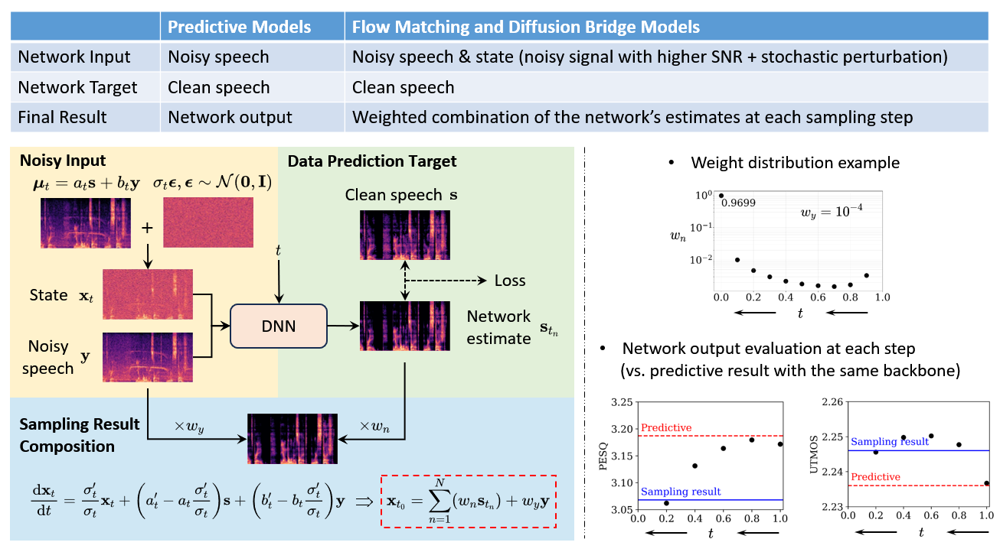
</p>

### 3. Enhanced Bridge Model:
- Incorporating advanced predictive strategies and leading to improved performance.

<p align="center">
  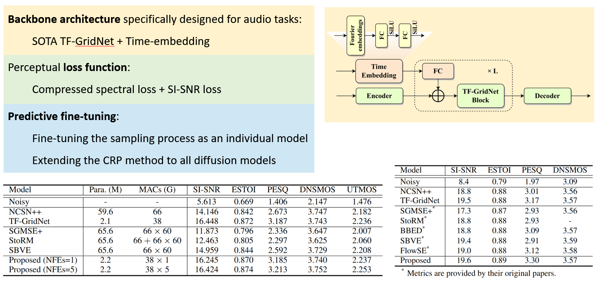
</p>


## Usage
- Adjust `fdbm/data_module.py` to fit your dataset.
- For training:
  ```bash
  python train.py -D <available_gpus>  # e.g. -D 0 1 2 3
  ```
  See `config.yaml` for the training configuration.

- For fine-tuning:
  ```bash
  python train_finetuning.py -D <available gpus>
  ```
  See `config_finetuning.yaml` for the fine-tuning configuration.

- For predictive model training:
  ```bash
  python train.py -D <available_gpus> -C config_predictive.yaml
  ```
  See `config_predictive.yaml` for the training configuration.

- For testing:
  ```bash
  python infer_single.py -D <available_gpu>
  python infer_folder.py -D <available_gpus>
  ```
  See `config_infer_single.yaml` and `config_infer_folder.yaml` for the testing configuration.


## Audio Samples

- See `audio_samples` for wav files.
- Example spectrograms

  Example audio samples and their spectrograms are presented. The baselines SGMSE+ and StoRM produce seemingly high-quality samples, but contain many semantic errors. SBVE demonstrates strong noise reduction performance, yet suffers from substantial loss of spectral detail. In contrast, the proposed method achieves a better balance between noise suppression and speech preservation. As noted in the paper, the proposed method also slightly outperforms the predictive TF-GridNet, although the improvement is marginal.

### 1. Sample 1

| Noisy | Clean | Baseline SGMSE+ | Baseline StoRM |
|:-------:|:-------:|:---------:|:--------:|
| [🔊 Audio](audio_samples/Sample1_Noisy.wav)<br>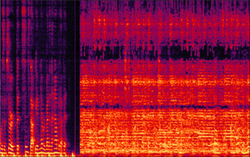<br>*PESQ=1.041   DNSMOS=2.556* | [🔊 Audio](audio_samples/Sample1_Clean.wav)<br>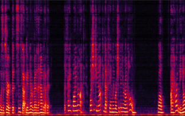<br>*PESQ=4.500 DNSMOS=3.224* | [🔊 Audio](audio_samples/Sample1_Baseline_SGMSE+.wav)<br>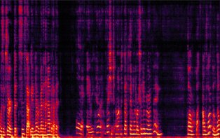<br>*PESQ=1.068 DNSMOS=2.799* | [🔊 Audio](audio_samples/Sample1_Baseline_StoRM.wav)<br>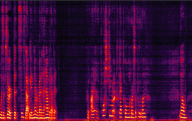<br>*PESQ=1.247 DNSMOS=3.164* |
| **Baseline SBVE** | **Baseline TF-GridNet** | **Proposed** | |
| [🔊 Audio](audio_samples/Sample1_Baseline_SBVE.wav)<br>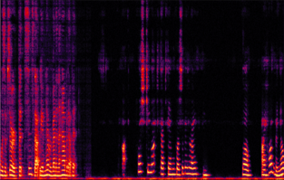<br>*PESQ=1.489 DNSMOS=3.174* | [🔊 Audio](audio_samples/Sample1_Baseline_TF-GridNet.wav)<br>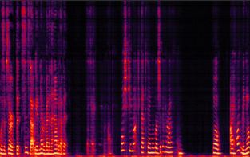<br>*PESQ=1.957 DNSMOS=3.174* | [🔊 Audio](audio_samples/Sample1_Proposed.wav)<br>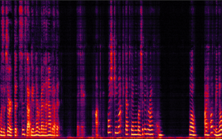<br>*PESQ=2.052 DNSMOS=3.418* | |

### 2. Sample 2

| Noisy | Clean | Baseline SGMSE+ | Baseline StoRM |
|:-------:|:-------:|:---------:|:--------:|
| [🔊 Audio](audio_samples/Sample2_Noisy.wav)<br>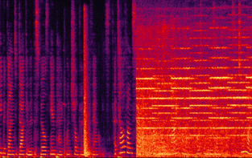<br>*PESQ=1.054 DNSMOS=2.920* | [🔊 Audio](audio_samples/Sample2_Clean.wav)<br>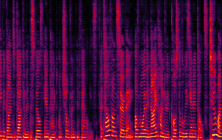<br>*PESQ=4.500 DNSMOS=3.785* | [🔊 Audio](audio_samples/Sample2_Baseline_SGMSE+.wav)<br>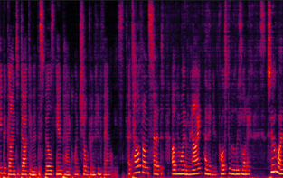<br>*PESQ=1.437 DNSMOS=3.511* | [🔊 Audio](audio_samples/Sample2_Baseline_StoRM.wav)<br>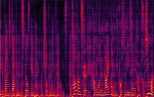<br>*PESQ=1.502 DNSMOS=3.682* |
| **Baseline SBVE** | **Baseline TF-GridNet** | **Proposed** | |
| [🔊 Audio](audio_samples/Sample2_Baseline_SBVE.wav)<br>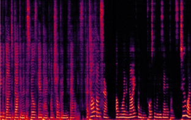<br>*PESQ=1.342 DNSMOS=3.622* | [🔊 Audio](audio_samples/Sample2_Baseline_TF-GridNet.wav)<br><br>*PESQ=2.114 DNSMOS=3.863* | [🔊 Audio](audio_samples/Sample2_Proposed.wav)<br>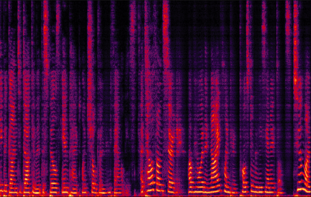<br>*PESQ=2.237 DNSMOS=3.899* | |

### 3. Sample 3

| Noisy | Clean | Baseline SGMSE+ | Baseline StoRM |
|:-------:|:-------:|:---------:|:--------:|
| [🔊 Audio](audio_samples/Sample3_Noisy.wav)<br>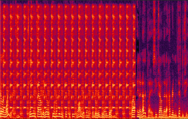<br>*PESQ=1.068 DNSMOS=2.976* | [🔊 Audio](audio_samples/Sample3_Clean.wav)<br>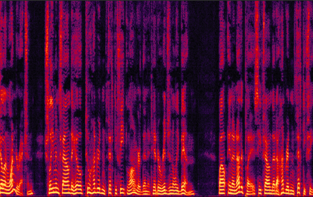<br>*PESQ=4.500 DNSMOS=4.185* | [🔊 Audio](audio_samples/Sample3_Baseline_SGMSE+.wav)<br>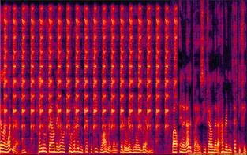<br>*PESQ=1.111 DNSMOS=3.840* | [🔊 Audio](audio_samples/Sample3_Baseline_StoRM.wav)<br>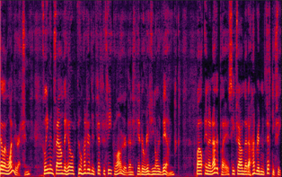<br>*PESQ=1.764 DNSMOS=4.010* |
| **Baseline SBVE** | **Baseline TF-GridNet** | **Proposed** | |
| [🔊 Audio](audio_samples/Sample3_Baseline_SBVE.wav)<br>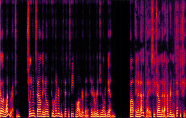<br>*PESQ=1.815 DNSMOS=3.834* | [🔊 Audio](audio_samples/Sample3_Baseline_TF-GridNet.wav)<br>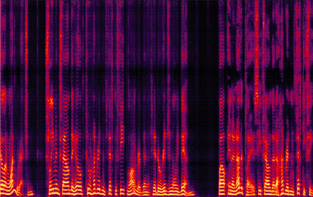<br>*PESQ=2.821 DNSMOS=3.934* | [🔊 Audio](audio_samples/Sample3_Proposed.wav)<br>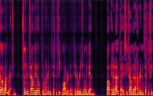<br>*PESQ=2.902 DNSMOS=4.076* | |

## Citation
